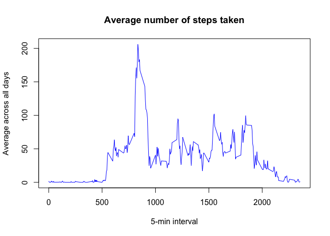

# Reproducible Research: Peer Assessment 1
Ashwin Rao  
April 15, 2015  

```r
library(knitr)
opts_chunk$set(fig.path = "./figures/")
```


-------------

[If you are looking for the final result, please go here!](https://github.com/ashwingrao/RepData_PeerAssessment1/blob/master/PA1_template.md "Click Here")

-------------

## Assumptions
It is assumed that we are currently in the folder where the data is. If this is not the case, please use setwd() to change the working directory like the following statement


```r
setwd("~/Documents/DropBox-AGR/Dropbox/Git/coursera//Reproducible/RepData_PeerAssessment1/")
```

## Loading and preprocessing the data

### Now we can load the data (i.e. read.csv())


```r
rm(list=ls())
dt <- read.csv("activity.csv")
```

### Process/transform the data (if necessary) into a format suitable for our analysis
We observe that the variable dt has 17568 rows, and 3 columns.

We have to convert the date column from double to Date, we can use as.Date function 
We now have the summary statistics of:

```r
str(dt)
```

```
## 'data.frame':	17568 obs. of  3 variables:
##  $ steps   : int  NA NA NA NA NA NA NA NA NA NA ...
##  $ date    : Date, format: "2012-10-01" "2012-10-01" ...
##  $ interval: int  0 5 10 15 20 25 30 35 40 45 ...
```

## What is mean total number of steps taken per day?
### Calculate the total number of steps taken per day

```r
steps_aggregate <- aggregate(steps ~ date, data = dt, FUN=sum, na.exclude=TRUE)
```

### Histogram of total steps taken each day

```r
hist(x= steps_aggregate$steps, xlab = "Number of Steps", ylab = "Frequency", main = "Histogram of total steps taken each day", col = "blue")
```

 

### Calculate and report the mean and median of the total number of steps taken per day

```r
meanStepsPerDay1 <- mean(steps_aggregate$steps)
medianStepsPerDay1 <- median(steps_aggregate$steps)
```

Mean number of steps = 1.0767189\times 10^{4}  
Median number of steps = 10766

## What is the average daily activity pattern?

### Make a time series plot (i.e. type = "l") of the 5-minute interval (x-axis) and the average number of steps taken, averaged across all days (y-axis)


For this graph, we need the time interval (i.e. interval column)

```r
time_series <- tapply(dt$steps, dt$interval, mean, na.rm = TRUE)

plot(x = row.names(time_series), y = time_series, type = "l", xlab = "5-min interval", 
     ylab = "Average across all days", main = "Average number of steps taken", 
     col = "blue")
```

 

### Which 5-minute interval, on average across all the days in the dataset, contains the maximum number of steps?

```r
max_interval <- which.max(time_series)
```
Answer: Interval 835 contains the maximum number of steps.

## Imputing missing values

### Calculate and report the total number of missing values in the dataset (i.e. the total number of rows with NAs)

```r
dt_NA <- sum(is.na(dt))
```
Total number of missing values = 2304

### Devise a strategy for filling in all of the missing values in the dataset. 

We will take the mean for 5-minute interval

```r
stepsMean <- aggregate(steps ~ interval, data = dt, FUN = mean)
stepsList <- numeric()
for (i in 1:nrow(dt)) {
    row <- dt[i, ]
    if (is.na(row$steps)) {
        steps <- subset(stepsMean, interval == row$interval)$steps
    } else {
        steps <- row$steps
    }
    stepsList <- c(stepsList, steps)
}

newDt <- dt # Just make a copy so we don't lose the input table
newDt$steps <- stepsList
```

### Create a new dataset that is equal to the original dataset but with the missing data filled in.
The new dataset is "newDt"

```r
head(newDt)
```

```
##       steps       date interval
## 1 1.7169811 2012-10-01        0
## 2 0.3396226 2012-10-01        5
## 3 0.1320755 2012-10-01       10
## 4 0.1509434 2012-10-01       15
## 5 0.0754717 2012-10-01       20
## 6 2.0943396 2012-10-01       25
```

### Make a histogram of the total number of steps taken each day 

```r
steps_aggregate <- aggregate(steps ~ date, data = newDt, FUN=sum, na.exclude=TRUE)
hist(x= steps_aggregate$steps, xlab = "Number of Steps", ylab = "Frequency", main = "Histogram of total steps taken each day", col = "blue")
```

 

### and Calculate and report the mean and median total number of steps taken per day. 


```r
meanStepsPerDay2 <- mean(steps_aggregate$steps)
medianStepsPerDay2 <- median(steps_aggregate$steps)
```

Mean number of steps = 1.0767189\times 10^{4}  
Median number of steps = 1.0767189\times 10^{4}

### Do these values differ from the estimates from the first part of the assignment? 
After filling in the missing values, the Median has changed to same value as Mean

### What is the impact of imputing missing data on the estimates of the total daily number of steps?
Total daily number of steps are now 6.5679851\times 10^{5}

## Are there differences in activity patterns between weekdays and weekends?

### Create a new factor variable in the dataset with two levels – “weekday” and “weekend” indicating whether a given date is a weekday or weekend day.

```r
newDt$day <- weekdays(newDt$date)
typeOfWeek <- function(day){
  if (day %in% c("Saturday", "Sunday")) {
    return("Weekend")
  } 
  else {
    return("Weekday")
  }
} 

newDt$dayType <- factor(sapply(X = newDt$day, FUN = typeOfWeek))
```

### Make a panel plot containing a time series plot (i.e. type = "l") of the 5-minute interval (x-axis) and the average number of steps taken, averaged across all weekday days or weekend days (y-axis). 

```r
stepsByDay <- aggregate(steps ~ interval + dayType, data = newDt, mean)
names(stepsByDay) <- c("interval", "daylevel", "steps")

## Setup the layout
par(mfrow = c(2, 1),mar=rep(0,4), oma = c(4,4,3,3))

## Split up the dataset into WkDays & WkEnds.
newDtWk <- subset(x = newDt, dayType == "Weekday")
newDtWkEnd <- subset(x = newDt, dayType == "Weekend")

## Weekday Timeseries
time_series <- tapply(newDtWk$steps, newDtWk$interval, mean, na.rm = TRUE)

plot(x = row.names(time_series), y = time_series, type = "l", xlab = "", 
     ylab = "", main = "", axes = FALSE,
     col = "blue")

mtext("Weekdays", side = 3, line = -1)
# Add box around first plot region
box(); axis(2, labels=FALSE); axis(3, labels=FALSE); axis(4)

## Weekend Timeseries
time_series <- tapply(newDtWkEnd$steps, newDtWkEnd$interval, mean, na.rm = TRUE)

plot(x = row.names(time_series), y = time_series, type = "l", xlab = "", 
     ylab = "", main = "", axes = FALSE,
     col = "blue")
mtext("Weekends", side = 3, line = -1)

box()
# Add box around first plot region
box()
axis(1);axis(2)
```

 


